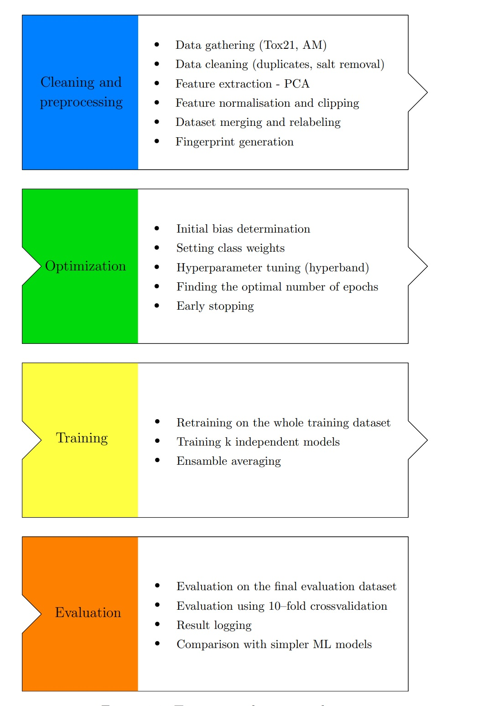

# Chemical Toxicity Prediction

[](https://github.com/your-username/toxicity-prediction/blob/master/LICENSE)
[](https://www.python.org/downloads/release)
[](https://www.tensorflow.org)
[](https://keras.io)
[](https://github.com/keras-team/keras-tuner)

## Overview

This project explores the application of traditional machine-learning and deep-learning for predicting molecular toxicity. It tackles the challenge of toxicity prediction by generating ~20 different molecular representations and compares their performance on a large variety of models. This code was used for my Master Thesis [Quantitative structure-activity relationship and machine learning](https://dspace.cuni.cz/handle/20.500.11956/181235).

## Features

- Utilizes TensorFlow and Keras for building and training deep neural network.
- Implements hyperparameter tuning using the [HyperBand algorithm](https://arxiv.org/abs/1603.06560)
- Supports cross-validation, ensemble modeling, various dimensionality reduction techniques and evaluation of key metrics.
- Conducts extensive cleaning and preprocessing of chemical data
- Offers a wide variety of molecular representations and models

## Table of Contents

- [Installation](#installation)
- [Usage](#usage)
- [Results](#results)
- [License](#license)
- [Acknowledgments](#acknowledgments)

## Installation

1. Clone the repository, install all dependencies into a virtual environment and activate it:

   ```sh
   git clone https://github.com/nierja/tox.git
   cd tox
   ./lib/initialize_venv.sh
   ```

## Usage

1. Generate descriptors for the training, validation and test datasets by running:

   ```python
   python3 src/descriptor_generation/generate.py
   ```

2. Tune the hyperpadameters and train the machine learning and deep learning models:

   ```python
   python3 src/DL/Tox21_tuner.py
   python3 src/ML/ML.py
   ```

3. You can set model parameters as CLI parameters:

   ```python
   python3 src/DL/Tox21_tuner.py --target=SR-ER --NN_type=DNN --n_layers=4 --fp=ecfp4
   ```

## Results



